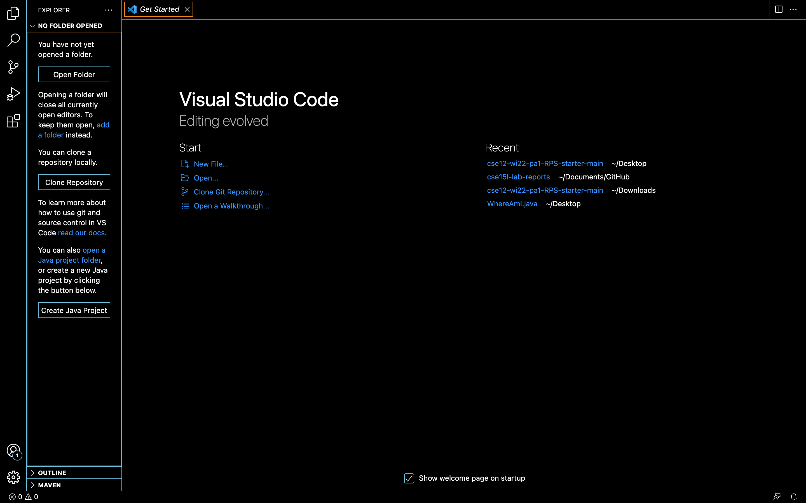
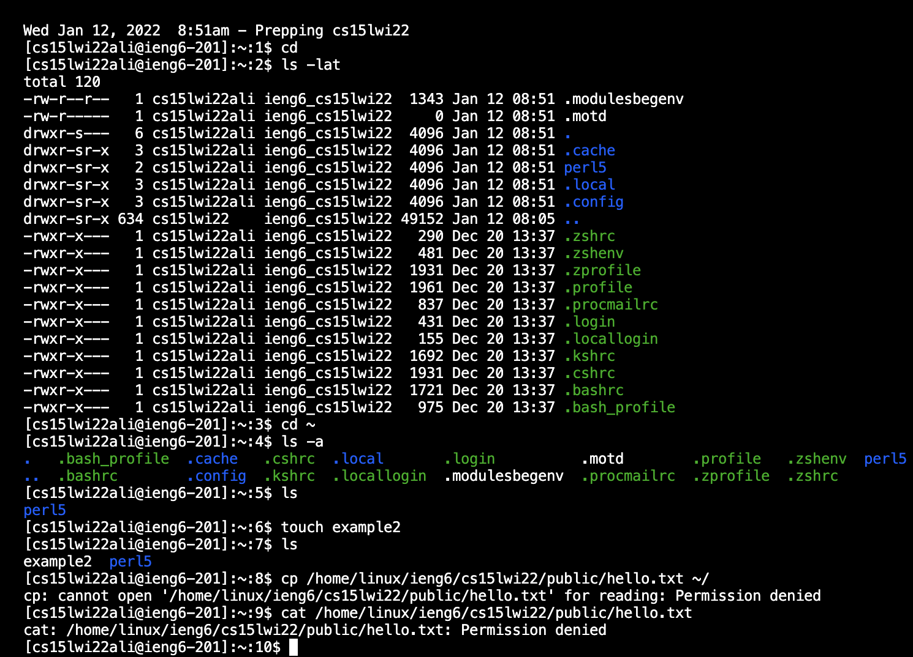
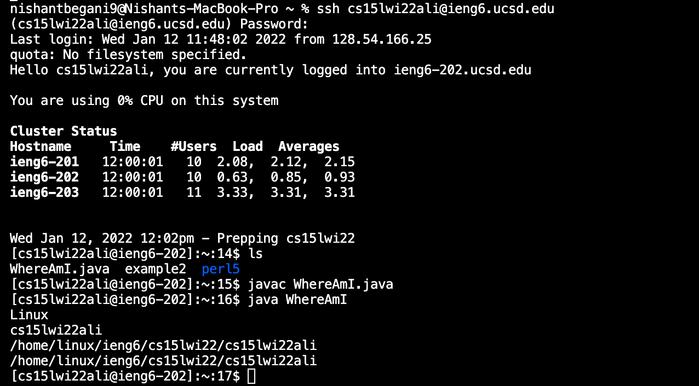

# _**LAB REPORT 1**_ 
### By Nishant Begani (A17051342)
---

**1. Installing VS Code**

You need to go to the Visual Studio Code website https://code.visualstudio.com/, and follow the instructions to download and install it on your computer. You can see the option of different versions of the operating system like the OSX and the Windows. 

**When you open the VS Code your window will look something like this.**

**2. Remotely Connecting the Client to the Server**

This course, CSE 15L, has a course specific CSE account. In here we will learn that how to connect to a remote server over the internet. 
We need to look up for the course specific account using this link -  
 > https://sdacs.ucsd.edu/~icc/index.php . 

Now we open a new terminal in VS Code and write a command which looks like - 
 
 > $ ssh cs15lwi22zz@ieng6.ucsd.edu 

 Here 'zz' will be replaced by the course specific letters (in my case 'zz' was replaced by 'ali'). 

 After which, we will receive a message asking [yes/no]. We need to type in yes to coonect to the server. 

**3. Running Some Commands**

Now you will try running some commands. We will run this both on the your computer(known as client) and the remote computer(known as server) by ssh -ing. 
Some of the commands you can try running are as follows:-

1. cd 
2. ls 
3. ls -lat 
4. ls -a 
5. dir

 

4. Moving Files with scp 

 

5. Setting an SSH Key 

