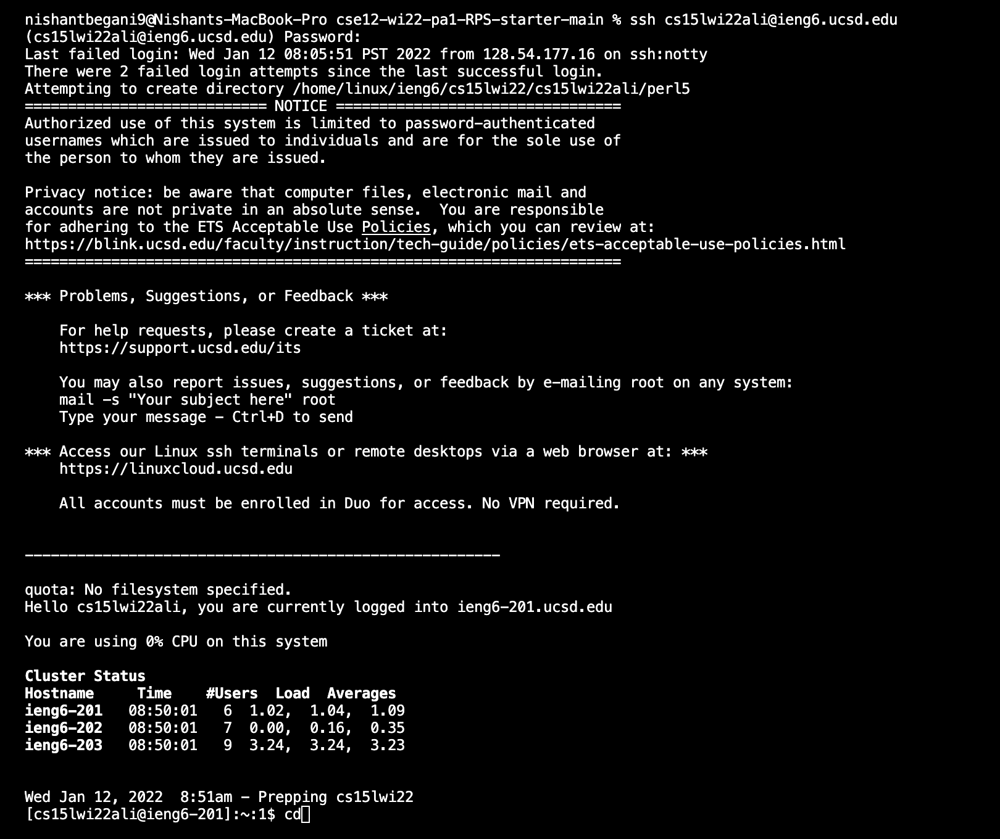

# _**LAB REPORT 1**_ 
### By Nishant Begani (A17051342)
---

**1. Installing VS Code**

You need to go to the [Visual Studio Code](https://code.visualstudio.com/), and follow the instructions to download and install it on your computer. You can see the option of different versions of the operating system like the OSX and the Windows. 

**When you open the VS Code your window will look something like this.**

**2. Remotely Connecting the Client to the Server**

This course, CSE 15L, has a course specific CSE account. In here we will learn that how to connect to a remote server over the internet. 
We need to look up for the course specific account using this link -  
 > https://sdacs.ucsd.edu/~icc/index.php . 

Now we open a new terminal in VS Code and write a command which looks like - 
 
 > $ ssh cs15lwi22zz@ieng6.ucsd.edu 

 Here 'zz' will be replaced by the course specific letters (in my case 'zz' was replaced by 'ali'). 

 After which, we will receive a message asking [yes/no]. We need to type in yes to coonect to the server. 

**3. Running Some Commands**

Now you will try running some commands. We will run this both on the your computer(known as client) and the remote computer(known as server) by ssh -ing. 
Some of the commands you can try running are as follows:-

>1. cd 
>2. ls 
>3. ls -lat 
>4. ls -a 
>5. dir

 

**4. Moving Files with 'scp'** 

One of the main steps in working remotely is being able to copy files back and forth between the client and the server. This is the way how we access Google Drive or the Dropbox files n one computer and the other. 

The command through which transfer the file from one computer to the other is by using 'scp' on the client computer, which without logging into 'ieng6'.  

To do this step you will create file, for example, WhereAmI.java using this code -

>class WhereAmI
>
>{
      >
  >public static void main(String[] args) 
  >
  >{
 >
    >
 >
    > System.out.println(System.getProperty("os.name"));
 >
    > System.out.println(System.getProperty("user.name"));
 >
    > System.out.println(System.getProperty("user.home"));
 > 
    > System.out.println(System.getProperty("user.dir");
 >
 >
 >
  >}
 >
  >
 >
 >}

Now you will javac and java this and this will give a message. Follwed by this we will run the following command on the client itself - 

> scp WhereAmI.java cs15lwi22zz@ieng6.ucsd.edu:~/ 

This will ask for the password as it asks when we run the ssh command. 
Now you will log in to the server using ssh and use 'ls' command. And, now we will again javac and java WhereAmI.java. Then you will notice a different location that appears, which mean that you have successfully transfered the file from the client to the server using the 'scp' command. 

 

**5. Setting an SSH Key** 

Now when we run the scp command, it always asks for the password. To type in the password again and again can be quite frustrating. A solution can be met to the problem if we use the ssh keys which contains a program called the ssh-keygen. 
What this does it that creates a two new files- the private key and the public key. The public key is copied to a particular location on the server and the private key is copied to a particular location on the client.  

The picture below shows the running of the ssh-keygen program. 

 

Now what has happend is that both the files have been created in our computer. 

The next step is to copy the public key (stored in a file id_rsa.pub) on the server. To do this we perform the following steps shown the pictures below. 

 

 

**6. Optimizing Remote Control** 

Since, we dont require the password now we can run all the commands in the following way - 

> $ ssh cs15lwi22@ieng6.ucsd.edu "pwd"

We can also run n number of commands in a single lan using a semicolon (this example is shown in the picture below). 

This is how we keep the remote connection smooth and efficient. 

 

 

