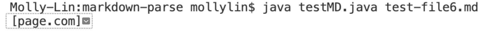

# _**LAB REPORT 2**_ 
### By Nishant Begani (A17051342)
---
In this lab report I have picked three code changes that my group worked on in labs 3 and 4 in order to fix a bug and to find the symptom. 

## **Code Change 1:** 

The error we are facing here constitutes to an infinite loop. 

 

After discussion in the group the change was made in line 17. 
This change was made for the file [lab.md](https://github.com/nishantbegani9/markdown-parse/blob/main/lab.md). 

The symptom we got before the change was an infinite loop and the output that resulted can be seen below:- 

 

Without the edited code, it results in an infinite loop, and it ends up using all the memory, hence causing the OutOfMemory error.

Before making changes to the code, the code as said resulted aan infinite loop, which used all the memory. This also resulted in an OutOfMemory error. 

Therefore, we can infer that bug is the problem caused by infinite loop. 

The symptom was a infinite output and the OutOfMemory Error. 

---

## **Code Change 2:** 

The fix that I am about to display is for [test-file6](https://github.com/nishantbegani9/markdown-parse/blob/main/test-file6.md). 

 

Incorrect output was produced and this was symptom with a wierd output because nothing should have beeen printed. 

 

The code which we wrote before cannot differentiate between the writing of a link and an image. 
Here nothing should have been printed if the test file contains an image. The new change to the code adds a extra if condition to check if there is an extra "!" before the opening square bracket "[". 

If the condition satisfies nothing will be added to the the toReturn substring. 

---

## **Code Change 3:** 

Now, here the fix I am about display is from the file [labnew.md](https://github.com/nishantbegani9/markdown-parse/blob/main/labnew.md). 

 

The symptom here is an incorrect output. Here nothing should be printed. But the ouptut prints. 

 

The code that we had previously will not work where there is anything in betweeen the closed bracket, which is **"]"**, and the open parenthesis, which is **"("**. In terms of markdown, this is not the proper format of how we print a link, but something is still getting printed. Therefore, here the new code recogonizes whether the open parenthesis, which is **"("** is just next to the closed bracket, which is **"]"**. 

