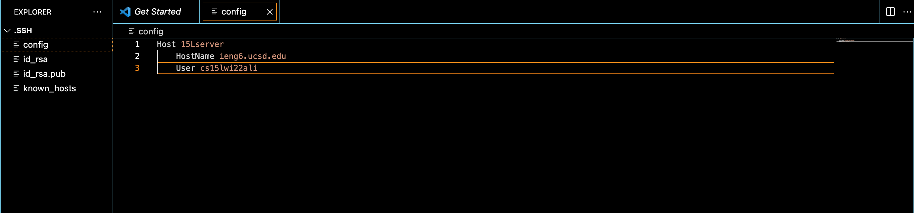
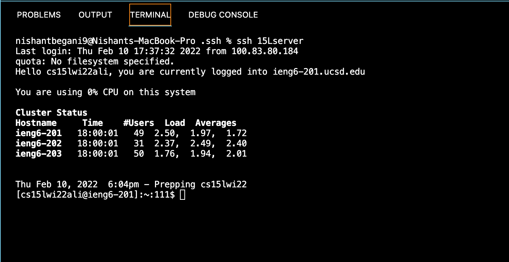
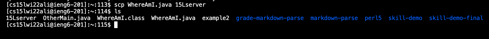

# **Lab Reprt 3**
### _Nishant Begani (PID: A17051342)_
---
For the setup I chose Group Choice 1: Streamline SSH Configuration. Below I have explained the setup using screenshots and short descriptions. 
## 1) Streamline SSH Configuration 

**i) .ssh/config File:-**

 

Above in the .ssh directory I have created a file named **config** on VS Code. This is a configuration file which will same us time for typing the the whole username for untering into the cse15L server.  
In this we put an entry into SSH of what username to use while logging into the server. We also give specific nicknames. 
For example, the nickname I used is **15Lserver**. I chose a short name so that it takes me even less time to log in into the ssh server. 

Here I also made sure of the proper indentations so that the configuration does not fail. 

**ii) New ssh Command Logging-In:-**

 

The above picture shows the running of the new ssh configuration using my new Host/nickname 15Lserver. 

In this process I also compared the time which I took logging using the old sh command and the new ssh command. It took me 15 seconds less to log in using the new ssh command. 

**iii) Copying a File Using scp Command and the Alias** choosen:- 

 

I copied the file WhereAmI.java from the client to the server using the scp command and the new alias. 

Previously the command I used to use for copying a file was:- 

> scp WhereAmI.java cs15lwi22zz@ieng6.ucsd.edu:~/

Now, instead of using the long username - **cs15lwi22zz@ieng6.ucsd.edu:~/** - I just to use the short nickname - **15Lserver**. 

Therefore, the new command is:- 

> scp WhereAmI.java 15Lserver  

I have also shown if the file has been copied or not using the **ls** command. After running the command, I could see that WhereAmI.java file has been copied to the server. I have also included this in the screenshot above. 

