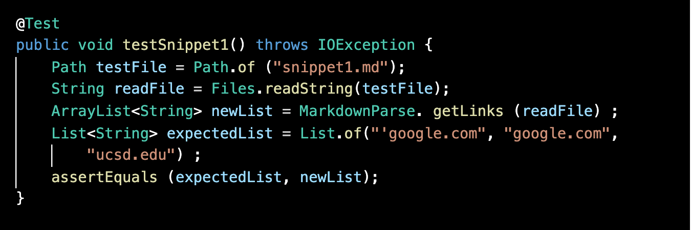
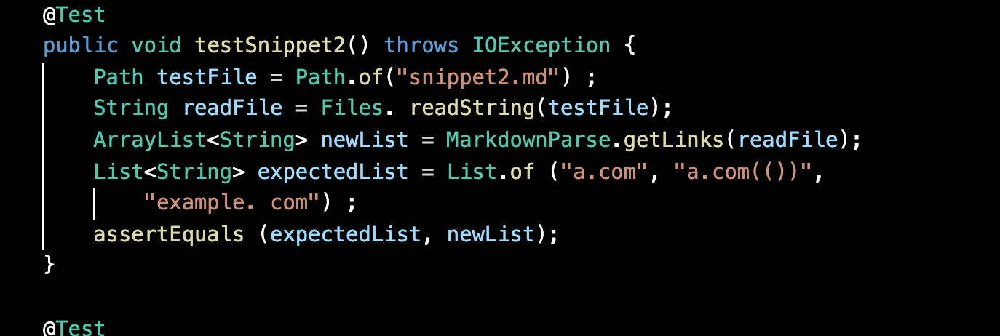
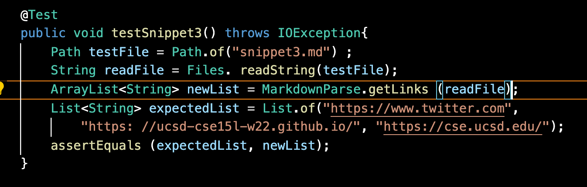
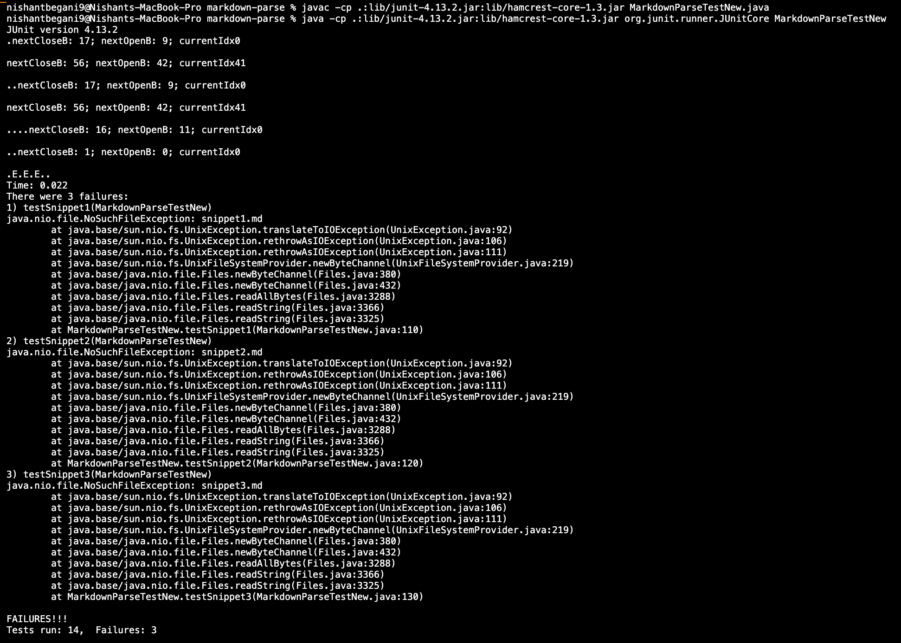
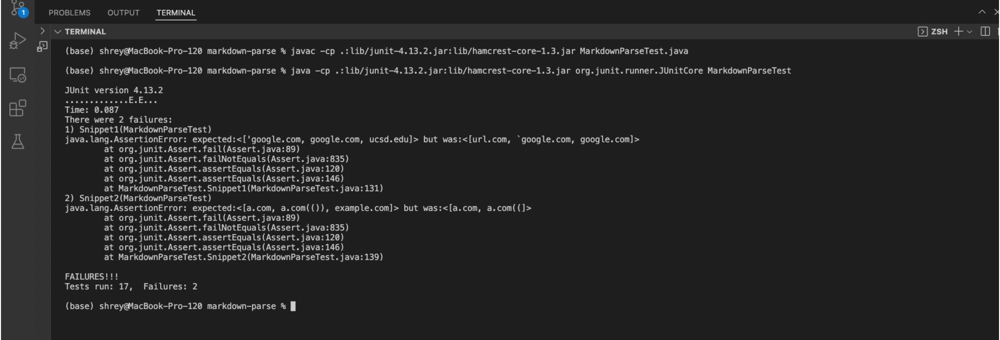

# **Lab Reprt 4**
### _Nishant Begani (PID: A17051342)_
---

## Links of the Implementation:-

[Our Group's Implementation of Markdown Parse](https://github.com/annakkin/markdown-parse)

[Implementation of Markdowwn Parse of the group we reviewed](https://github.com/vs2961/markdown-parse) 

***

## **Now I will show the Actual output of running the tests, Expected output and the testing code.** 

### **First let's look at the expected results of the Three Snippets:-**

**Snippet 1:-**

> [`google.com, google.com, ucsd.edu] 

**Snippet 2:-**

> [a.com, a.com(()), example.com]

**Snippet 3:-** 

> [https://www.twitter.com, https://ucsd-cse15l-w22.github.io/, https://cse.ucsd.edu/]

***

## **The JUnit tests that I have created for checking if the implemtations are working on the new snippets or not are as follows:-** 

 

 

 

***

### **Now let's see if these tests work on our implementation:-** 

 

Our group's Implementation **failed all the three tests.** 

### **Now let's see if these tests work on the other group's implementation:-** 

 

The other groups's Implementation **failed two tests**.

*** 

### **Since, in our implementation all the tests our failing, we can make the following changes to the code for each of the snippets:-** 

**1)** **Here for passsing the test for Snippet 1 let's look at the Backticks:-** 

Here, **we should add lines to look for the the paired bracket at the outside. We should do this before checking gor the the open paranthesis in the same line.**
We should notice that the link will not be valid if the backtick is just before the open bracket of the pair. We should also check that if there is a backtick just before the close brack bracket and just after the open bracket inside the paired brackets. If this is true the link is valid. 

But, if there is only one backtick that is just after open bracket or just before the close bracket, then we have to to check for an unpaired bracket. Hence, the link will not be valid when there is an unpaired close bracket. 

**2)** **Here for passing the test for Snippet 2 let's look at the brackets and the nested parenthesis:-**

Here, we have to **check for the closed bracket**. If their is an upaired one present inside the paired bracket itself then we would assume this to be **not a valid link**. Now, if we also try to include a **check for the paired parenthesis or the brackets where we check for the outermost bracket pair with the close bracket before the open parenthesis**. We will consider **this a valid link** and the JUnit test will pass. 

**3)** **Here for passing the test for Snippet 3 let's look at the new lines included in the paranthesis and the brackets:-**

Here, **we can trim the spaces after the open parenthesis and before the close parentheses**. Then **we have to look for this character - `\n` - inside the string**. If the character is not present and if the string in is in the format of the link then the link is **considered to be valid**. **If these conditions do not satisfy the link will not considered valid.** 

