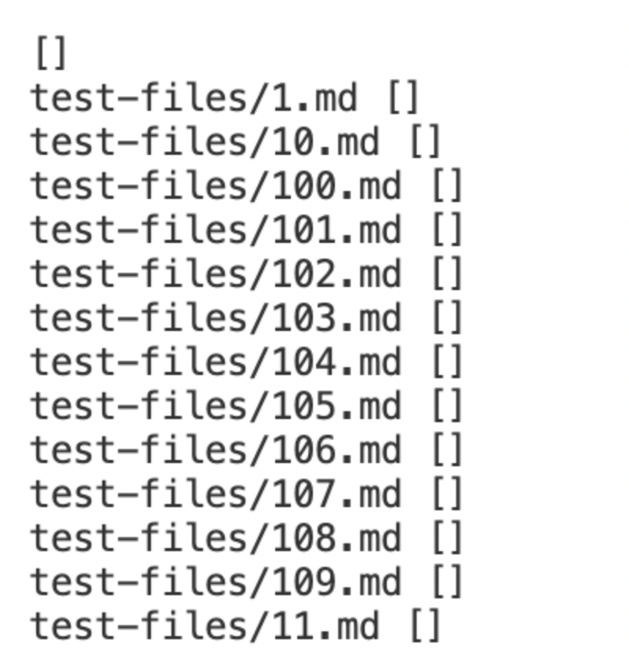

# **Lab Reprt 5**
### _Nishant Begani (PID: A17051342)_
---

The first step which we took is to add a statement in the bash file, which was ```echo -n "$file"```. This added the names of the files with the outputs, which made it easy to comapre the two different outputs of two different implementations. 

 

***

Now we had to export all the test results for both the implementations to a text file. 

We had use the following command to do so:- 

```bash script.sh > <filename>.txt```

Hence, the results of the text files should look like this:- 

 

***

Now we had to comapre the results saved in two seperate text files of two different implementations. 
To comapre the keyword we had to use is ```diff```. Hence, the command I used is:- 

```diff markdown-parse/out.txt MarkdownParse/results.txt``` 

When I ran this command in the terminal I got this result as my output:- 

 

***

Now, let's look at the two tests with different results. 

