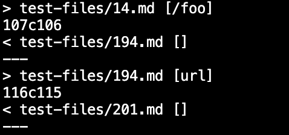
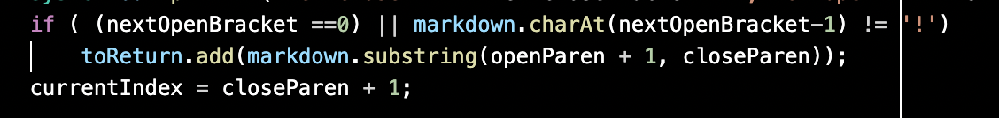
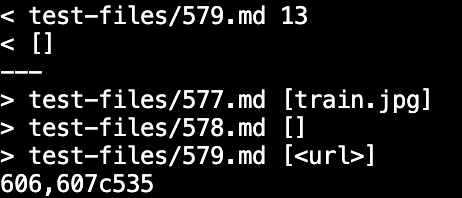
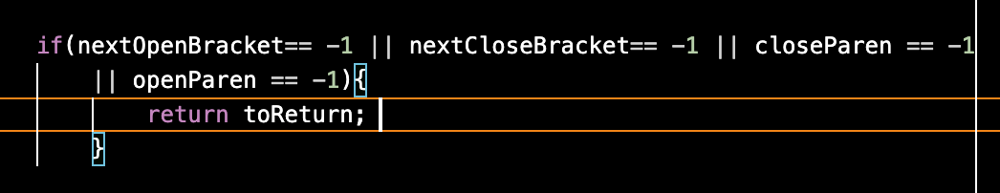

# **Lab Reprt 5**
### _Nishant Begani (PID: A17051342)_
---

The first step which we took is to add a statement in the bash file, which was ```echo -n "$file"```. This added the names of the files with the outputs, which made it easy to comapre the two different outputs of two different implementations. 

 

***

Now we had to export all the test results for both the implementations to a text file. 

We had use the following command to do so:- 

```bash script.sh > <filename>.txt```

Hence, the results of the text files should look like this:- 

 

***

Now we had to comapre the results saved in two seperate text files of two different implementations. 
To comapre the keyword we had to use is ```diff```. Hence, the command I used is:- 

```diff markdown-parse/out.txt MarkdownParse/results.txt``` 

When I ran this command in the terminal I got this result as my output:- 

 

***

Now, let's look at the two tests with different results. 

The **first** test have chosen is **Test File 194** 

For the  ```test-files/194.md``` given implementation gives the correct output. 

 

Here we can see that:- 

My implementation gives ```[]``` for ```test-files/194.md```.

The provided implementation gives ```[url]``` for ```test-files/194.md```.

The actual output should have been ```/url```. 

I think, this happened because the implementation did not deal with a new line ```\n``` character in the method geLinks(). 

 

The new cde block can be added after this part of the code. 

***

The **second** test have chosen is **Test File 579**  

For the  ```test-files/579.md``` my implementation gives the correct output.

 

Here we can see that:-

My implementation gives ```[]``` for ```test-files/579.md```.

The provided implementation gives ```[<url>]``` for ```test-files/579.md```.


The actual output should have been empty in accordance with ```579.html.test```

This happened because the other implementation didn't deal the format of the image in the markdownparse. 

The Implementation that can be added to test the existence of ```!``` before the open bracket. 

And, in the situation where ```!``` is present will not be a valid link.  

 

The condition suggested above can be implemented after or before the above condition in the image. 

***